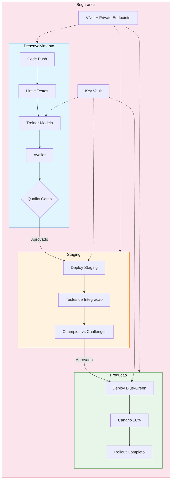
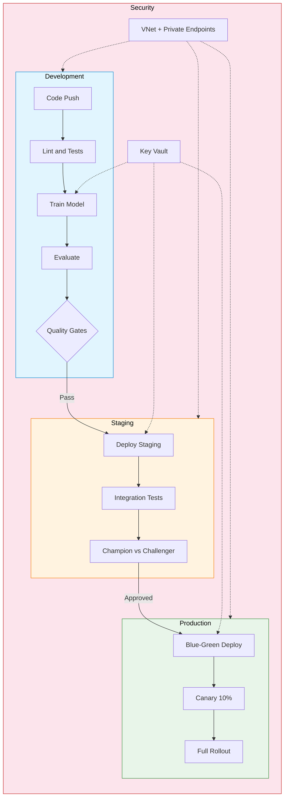

<div align="center">

# Azure ML CI/CD Pipeline

[](https://python.org)
[](https://azure.microsoft.com/)
[](https://azure.microsoft.com/products/devops)
[](https://github.com/features/actions)
[](https://learn.microsoft.com/azure/azure-resource-manager/bicep/)
[](LICENSE)

Pipeline CI/CD completo para modelos de Machine Learning no Azure com testes automatizados, deploy multi-ambiente e infraestrutura como codigo (Bicep).

Complete CI/CD pipeline for Machine Learning models on Azure with automated testing, multi-environment deployment, and Infrastructure as Code (Bicep).

[Portugues](#portugues) | [English](#english)

</div>

---

<a name="portugues"></a>
## Portugues

### Sobre

Este projeto implementa um pipeline CI/CD de ponta a ponta para modelos de Machine Learning no ecossistema Azure. O sistema abrange todo o ciclo de vida de MLOps: submissao de jobs de treinamento com Azure ML SDK v2, avaliacao automatizada com quality gates configurados por ambiente, deploy blue-green com trafego canario para producao com zero downtime, e comparacao champion/challenger para promocao de modelos baseada em dados. A infraestrutura e inteiramente definida em Bicep (IaC) com modulos para ML Workspace, clusters de computacao CPU/GPU, Key Vault, VNet com private endpoints e NSG. O pipeline suporta Azure DevOps, GitHub Actions e Jenkins, com seguranca integrada (managed identity, Key Vault, isolamento de rede) e observabilidade via Application Insights.

### Tecnologias

| Tecnologia | Descricao |
|---|---|
| Python 3.11+ | Linguagem principal |
| Azure ML SDK v2 | Treinamento, HyperDrive, registro de modelos |
| Azure DevOps | Pipeline CI/CD completo (8 estagios) |
| GitHub Actions | CI com lint, testes, Docker, validacao Bicep |
| Jenkins | Pipeline multi-estagio com gates de aprovacao |
| Bicep | Infraestrutura como Codigo (ML Workspace, Compute, VNet, Key Vault) |
| Azure Key Vault | Gerenciamento de segredos com rotacao |
| Application Insights | Telemetria, metricas customizadas, rastreamento |
| Docker | Imagem multi-stage para producao |

### Arquitetura



### Estrutura do Projeto

```
azure-ml-cicd-pipeline/
├── .github/workflows/
│   └── ci.yml                          # GitHub Actions CI
├── config/
│   └── pipeline_config.yaml            # Configuracao centralizada
├── docker/
│   ├── Dockerfile                      # Imagem multi-stage
│   └── docker-compose.yml              # Ambiente local
├── infra/bicep/
│   ├── main.bicep                      # Orquestracao de infraestrutura
│   └── modules/
│       ├── ml-workspace.bicep          # ML Workspace + App Insights + ACR
│       ├── compute.bicep               # Clusters CPU/GPU
│       ├── storage.bicep               # Storage account
│       ├── keyvault.bicep              # Key Vault + diagnosticos
│       └── networking.bicep            # VNet, subnets, NSG
├── pipelines/
│   ├── azure-devops/azure-pipelines.yml
│   └── jenkins/Jenkinsfile
├── src/
│   ├── config/settings.py              # Configuracoes de ambientes
│   ├── training/
│   │   ├── azure_trainer.py            # Jobs de treinamento e HyperDrive
│   │   └── data_handler.py             # Data Assets e versionamento
│   ├── evaluation/
│   │   └── model_evaluator.py          # Quality gates e comparacao de metricas
│   ├── deployment/
│   │   ├── endpoint_manager.py         # Endpoints gerenciados e blue-green
│   │   └── environment_promoter.py     # Promocao entre ambientes
│   ├── security/
│   │   ├── key_vault.py                # Gerenciamento de segredos
│   │   └── network.py                  # VNet, private endpoints, NSG
│   ├── monitoring/
│   │   └── app_insights.py             # Metricas customizadas e telemetria
│   └── utils/
│       └── logger.py                   # Logging estruturado (JSON + console)
├── tests/
│   ├── conftest.py
│   ├── unit/
│   └── integration/
├── Makefile
├── CONTRIBUTING.md
├── requirements.txt
├── LICENSE
└── README.md
```

### Inicio Rapido

```bash
# Clonar o repositorio
git clone https://github.com/galafis/azure-ml-cicd-pipeline.git
cd azure-ml-cicd-pipeline

# Criar ambiente virtual
python -m venv .venv
source .venv/bin/activate  # Windows: .venv\Scripts\activate

# Instalar dependencias
make install

# Configurar variaveis de ambiente
export AZURE_ML_SUBSCRIPTION_ID="sua-subscription-id"
export AZURE_ML_RESOURCE_GROUP="seu-resource-group"
export AZURE_ML_WORKSPACE_NAME="seu-workspace"
```

### Testes

```bash
make test              # Todos os testes
make test-unit         # Apenas testes unitarios
make test-integration  # Testes de integracao
make coverage          # Relatorio de cobertura
make quality           # Lint + format + typecheck
```

### Infraestrutura

```bash
make infra-validate       # Validar templates Bicep
make infra-deploy-dev     # Deploy ambiente dev
make infra-deploy-staging # Deploy ambiente staging
make infra-deploy-prod    # Deploy ambiente producao
```

### Configuracao por Ambiente

| Configuracao | Dev | Staging | Prod |
|---|---|---|---|
| Compute VM | DS2_v2 | DS3_v2 | NC6s_v3 (GPU) |
| Max Nodes | 2 | 4 | 8 |
| Blue-Green | Desabilitado | Habilitado | Habilitado |
| Accuracy Gate | >= 0.70 | >= 0.80 | >= 0.85 |
| VNet Isolation | Opcional | Habilitado | Obrigatorio |
| Private Endpoints | Nao | Sim | Sim |

### Aprendizados

- Implementacao de pipelines CI/CD multi-estagio para ML (Azure DevOps, GitHub Actions, Jenkins)
- Deploy blue-green com trafego canario e rollback automatico
- Quality gates com thresholds de metricas por ambiente
- Infraestrutura como Codigo com Bicep (modulos reutilizaveis)
- Seguranca: Key Vault, managed identity, VNet isolation, private endpoints
- Observabilidade com Application Insights e metricas customizadas

### Autor

**Gabriel Demetrios Lafis**
- GitHub: [@galafis](https://github.com/galafis)
- LinkedIn: [Gabriel Demetrios Lafis](https://linkedin.com/in/gabriel-demetrios-lafis)

### Licenca

Este projeto esta licenciado sob a [Licenca MIT](LICENSE).

---

<a name="english"></a>
## English

### About

This project implements an end-to-end CI/CD pipeline for Machine Learning models in the Azure ecosystem. The system covers the entire MLOps lifecycle: training job submission with Azure ML SDK v2, automated evaluation with environment-configured quality gates, blue-green deployment with canary traffic shifting for zero-downtime production releases, and champion/challenger comparison for data-driven model promotion. The infrastructure is entirely defined in Bicep (IaC) with modules for ML Workspace, CPU/GPU compute clusters, Key Vault, VNet with private endpoints, and NSG. The pipeline supports Azure DevOps, GitHub Actions, and Jenkins, with integrated security (managed identity, Key Vault, network isolation) and observability via Application Insights.

### Technologies

| Technology | Description |
|---|---|
| Python 3.11+ | Core language |
| Azure ML SDK v2 | Training, HyperDrive, model registration |
| Azure DevOps | Full CI/CD pipeline (8 stages) |
| GitHub Actions | CI with lint, tests, Docker, Bicep validation |
| Jenkins | Multi-stage pipeline with approval gates |
| Bicep | Infrastructure as Code (ML Workspace, Compute, VNet, Key Vault) |
| Azure Key Vault | Secret management with rotation |
| Application Insights | Telemetry, custom metrics, tracking |
| Docker | Multi-stage production image |

### Architecture



### Project Structure

```
azure-ml-cicd-pipeline/
├── .github/workflows/
│   └── ci.yml                          # GitHub Actions CI
├── config/
│   └── pipeline_config.yaml            # Centralized configuration
├── docker/
│   ├── Dockerfile                      # Multi-stage image
│   └── docker-compose.yml              # Local environment
├── infra/bicep/
│   ├── main.bicep                      # Infrastructure orchestration
│   └── modules/
│       ├── ml-workspace.bicep          # ML Workspace + App Insights + ACR
│       ├── compute.bicep               # CPU/GPU clusters
│       ├── storage.bicep               # Storage account
│       ├── keyvault.bicep              # Key Vault + diagnostics
│       └── networking.bicep            # VNet, subnets, NSG
├── pipelines/
│   ├── azure-devops/azure-pipelines.yml
│   └── jenkins/Jenkinsfile
├── src/
│   ├── config/settings.py              # Environment configurations
│   ├── training/
│   │   ├── azure_trainer.py            # Training jobs and HyperDrive
│   │   └── data_handler.py             # Data Assets and versioning
│   ├── evaluation/
│   │   └── model_evaluator.py          # Quality gates and metric comparison
│   ├── deployment/
│   │   ├── endpoint_manager.py         # Managed endpoints and blue-green
│   │   └── environment_promoter.py     # Environment promotion
│   ├── security/
│   │   ├── key_vault.py                # Secret management
│   │   └── network.py                  # VNet, private endpoints, NSG
│   ├── monitoring/
│   │   └── app_insights.py             # Custom metrics and telemetry
│   └── utils/
│       └── logger.py                   # Structured logging (JSON + console)
├── tests/
│   ├── conftest.py
│   ├── unit/
│   └── integration/
├── Makefile
├── CONTRIBUTING.md
├── requirements.txt
├── LICENSE
└── README.md
```

### Quick Start

```bash
# Clone the repository
git clone https://github.com/galafis/azure-ml-cicd-pipeline.git
cd azure-ml-cicd-pipeline

# Create virtual environment
python -m venv .venv
source .venv/bin/activate  # Windows: .venv\Scripts\activate

# Install dependencies
make install

# Set environment variables
export AZURE_ML_SUBSCRIPTION_ID="your-subscription-id"
export AZURE_ML_RESOURCE_GROUP="your-resource-group"
export AZURE_ML_WORKSPACE_NAME="your-workspace"
```

### Tests

```bash
make test              # All tests
make test-unit         # Unit tests only
make test-integration  # Integration tests
make coverage          # Coverage report
make quality           # Lint + format + typecheck
```

### Infrastructure

```bash
make infra-validate       # Validate Bicep templates
make infra-deploy-dev     # Deploy dev environment
make infra-deploy-staging # Deploy staging environment
make infra-deploy-prod    # Deploy production environment
```

### Environment Configuration

| Setting | Dev | Staging | Prod |
|---|---|---|---|
| Compute VM | DS2_v2 | DS3_v2 | NC6s_v3 (GPU) |
| Max Nodes | 2 | 4 | 8 |
| Blue-Green | Disabled | Enabled | Enabled |
| Accuracy Gate | >= 0.70 | >= 0.80 | >= 0.85 |
| VNet Isolation | Optional | Enabled | Enforced |
| Private Endpoints | No | Yes | Yes |

### Learnings

- Implementing multi-stage CI/CD pipelines for ML (Azure DevOps, GitHub Actions, Jenkins)
- Blue-green deployment with canary traffic shifting and automated rollback
- Quality gates with per-environment metric thresholds
- Infrastructure as Code with Bicep (reusable modules)
- Security: Key Vault, managed identity, VNet isolation, private endpoints
- Observability with Application Insights and custom metrics

### Author

**Gabriel Demetrios Lafis**
- GitHub: [@galafis](https://github.com/galafis)
- LinkedIn: [Gabriel Demetrios Lafis](https://linkedin.com/in/gabriel-demetrios-lafis)

### License

This project is licensed under the [MIT License](LICENSE).
